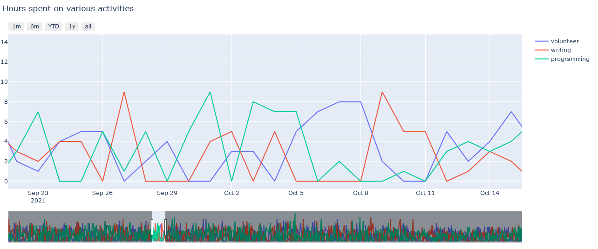

# pyClocker
A Cli app that keeps track of time spent on hobbies. This app can track time for multiple hobbies over a period of time.
I wanted to measure how much time I actually spend on programming daily.

Database Model:

It just consists of one entity called worksessions with the following attributes:
* ```id``` primary key
* ```date``` on what date a worksession started 
* ```activity``` name of the activity to keep track of time spent on.
* ```start_time``` timestamp when a worksession started 
* ```stop_time``` timestamp when the current work session stopped 


This cli has the following commands.

* ```start```: This creates a new record in a database with ```date``` as current date and ```start_time``` as current timestamp.
If there already exists an on going worksession(a record with ```date``` as current date and ```stop_time``` as null), the app notifies the user to end the current worksession first. One can specify the name of the activity with the flag ```--activity <activity name>```  default activity is ```programming```.

* ```stop```: This updates the ```stop_time``` of the record in a database that has ```date``` as current date, ```start_time``` as the timestamp with the latest value and ```stop_time``` as null, with  current timestamp.
If such a record does not exist in the database, the app notifies the user to start a new worksession first.

* ```today```: This returns the total hours one has invested in programming today.
it does this by computing the sum of difference between ```stop_time``` and ```start_time``` having ```date``` as current date and ```stop_time``` as not null.

* ```daily```: This displays a graph showing hours invested in programming every day.

It is built using these amazing projects [Typer](https://github.com/tiangolo/typer), [Plotly](https://github.com/plotly), [tabulate](https://github.com/astanin/python-tabulate)

## To run

1. To install the CLI, after activating a virtual environment run ```pip install .```
 
2. run ```pyClocker init``` to set the sqlite database file location.

3. Fake data generator is provided for visualization purposes, to generate fake data
after changing to ```fakedatagen``` directory, run ```python3 datagen.py```

4. The above step would generate sqlite database file called ```worksessions.db``` in the current folder. Move this generated file to the location that was set in step 2. Then run ```pyClocker daily``` to see a graph showing time spent on various activity on each day.


## TODO

- [x] Add the ability to track time for multiple activities.
- [x] ceate a plot to see how much time was spent in each activity over time